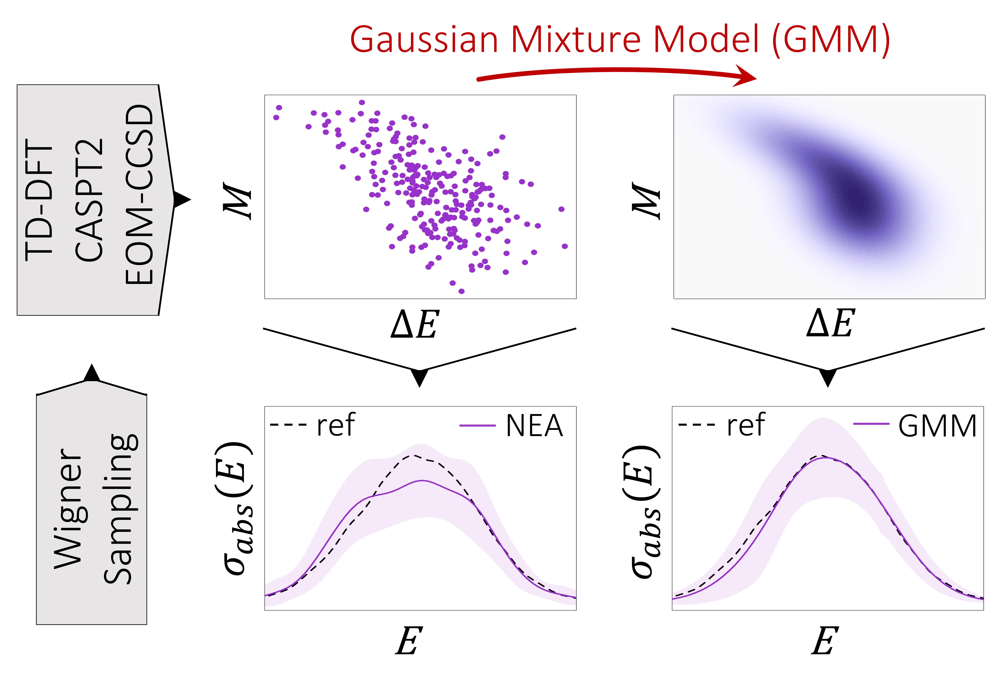
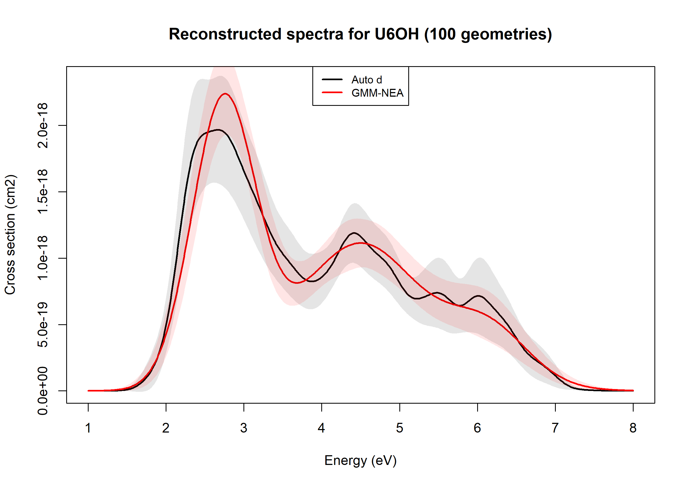
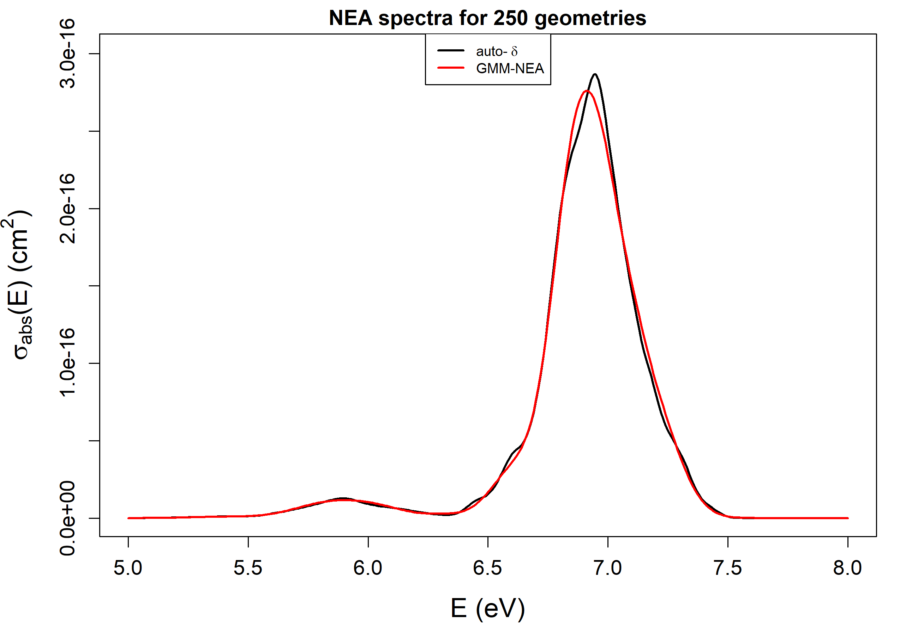

GMM-NEA 
======

## Overview

`R` code implementing the methodologies reported in the paper "*Reconstruction of Nuclear Ensemble Approach Electronic Spectra using Probabilistic Machine Learning*" 
([L. Cerdán and D. Roca-Sanjuán, 2022](https://pubs.acs.org/doi/10.1021/acs.jctc.2c00004)). 
It contains a fully functional version of the algorithm to reconstruct the NEA spectra using Kernel Density Estimation (KDE) Silverman's rule of thumb to choose the phenomenological
bandwidth *d* (auto-*d*) and using Gaussian Mixture Models to avoid *d* altogether (GMM-NEA).



## Requirements and Dependencies

It requires the installation of [R](https://cran.r-project.org/) (and optionally the [Rstudio IDE](https://www.rstudio.com/products/rstudio/)).

Before running this script, make sure that the following packages (and their dependencies) are installed: 

`'doParallel'` `'foreach'` `'matrixStats'` `'mclust'` `'optparse'` `'parallel'` `'robustbase'` `'scales'` 

## Installation

1a) *Option a*: Clone this repository to your local machine

```
$ git clone https://github.com/lucerlab/GMM-NEA
```

1b) *Option b*: Save the source files `GMM_NEA.R` and `GMM_NEA_helper_funcs.R` into a folder.

#### Optional step (create executable) [for Linux distributions]

2) Go to the directory where the .R files are saved, and type:

```
$ chmod +x GMM_NEA.R
```

3) Save files `GMM_NEA.R` (now an executable) and `GMM_NEA_helper_funcs.R` into the directory of your choice (usually where binaries are saved)

You may have to change the shebang line `#!/usr/bin/Rscript` to specify where your `Rscript` binary is, 
as well as changing in `GMM_NEA.R` (line 52):

```
#### load file with auxiliary functions
source('GMM_NEA_helper_funcs.R', chdir = TRUE)
```

to:

```
#### load file with auxiliary functions
source('path_to_exec_file/GMM_NEA_helper_funcs.R', chdir = TRUE)
```

where `path_to_exec_file` is the absolute path of the directory where the executable file `GMM_NEA.R` has been saved.

## Usage

The script `GMM-NEA.R` ingests an input file with all available values of vertical excitation energies (*VEE*) and oscillator strengths (*f*),
 finds possible outliers, computes the optimal linewidths for each band and reconstructs the auto-*d* NEA spectrum, fits a GMM model for each band 
and reconstructs the GMM-NEA spectrum, and finally saves files with the generated spectra and information about the model hyperparameters. To alleviate the computational burden,
this implementation uses multi-threading parallelization.

The current implementation of GMM-NEA uses the command line parser `optparse` (inspired by Python's one) to pass arguments to the code. The options are:

- The argument `-f` (or `--file`) specifies the name of the `.csv` file with the *VEE* and *f* values.

- The *optional* argument `-p` (or `--path`) specifies the absolute or relative path of the folder containing the `.csv` file with the *VEE* and *f* values. 
If the path contains spaces, use quotations (`"` or `'`) to enclose the path. Example: `'home/results/folder with spaces'`. By default, it assumes the current directory.

- The *optional* argument `-m` (or `--molecule`) specifies the molecule name/identifier to add to the output files. If spaces in the molecule name are desired, enclose it 
with quotations (`"` or `'`).

- The *optional* argument `-t` (or `--threads`) specifies the number of threads to use in the multi-threading parallelization. By default, it uses all available threads (`-t -1`).

- The *optional* argument `-o` (or `--outliers`) specifies the program whether to remove (`-o TRUE`) or ignore (`-o FALSE`) outliers. By default, set to `FALSE`. A list of possible
outliers is always provided.

- The *optional* argument `-c` (or `--conf_inter`) specifies the program to compute (`-c TRUE`) or not (`-c FALSE`) the confidence intervals (CI) of the NEA spectrum. By default, set to `FALSE`.

- The *optional* argument `-l` (or `--lowerE`) sets the lower energy bound to save and plot spectra (in eV). By default, it is set automatically.

- The *optional* argument `-u` (or `--upperE`) sets the upper energy bound to save and plot spectra (in eV). By default, it is set automatically.

- The *optional* argument `-d` (or `--deltaE`) sets the energy step size to save and plot spectra (in eV). By default, it is set to `-d 0.01`.

- The *optional* argument `-h` (or `--help`), shows the help menu with above options.

#### Input and Output files

The input file must be a `.csv` file containing the values of *VEE* and *f* for all transitions/states (columns) and geometries/configurations (rows) needed
 to reconstruct the NEA spectrum. The first half of the columns contain the *VEE*, the second half the *f*. 
An example of this kind of file can be found in the folder `Data`.

Once the computation is over, the following files are saved into the directory specified by `-p`:

1. auto_d_spectra_eV_*n_geoms*_*molecule*.csv

2. GMM_NEA_spectra_eV_*n_geoms*_*molecule*.csv

3. Spectra_eV_auto_d_vs_GMM_NEA_*n_geoms*_*molecule*.pdf

Files 1 and 2 contain the dataset with the computed NEA absorption cross section (in cm^2) as a function of energy (in eV) 
for the whole spectrum (`sigma_cm2_full`) and for each transition (`sigma_cm2_Band_#`), together with their corresponding lower and upper 95%
confidence intervals (CI). File 3 is a plot of the NEA spectra computed both with auto-*d* and GMM-NEA (see examples below). Files with the NEA cross sections
as a function of wavelength (in nm) are as well generated. A sample of Files 1 and 2 can be found in the folder `Data`.

The headers in Files 1 and 2 summarize the input and the model parameters used to reconstruct the NEA spectra. For auto-*d* (File 1), it includes 
the empirical bandwidths *d* for each transition. For GMM-NEA (File 2), it includes the number of mixtures (*K*) and the model constraints
(*M*) for each transition. If any outlier is detected, the corresponding geometry/configuration
is stated as well in the header (*Possible outliers (geometry id)*). 


#### Before running the script (executable)

1) Open a terminal and export the paths to the `GMM_NEA.R` binary and `R` libraries:

```
$ export PATH=path_to_exec_file:$PATH 

$ export LD_LIBRARY_PATH=/usr/lib/R/library:$LD_LIBRARY_PATH
```

This last line might have to be changed depending on your installation. In case of doubt, open `R` and type `.libPaths()` to get the path.

2) To execute the program, run:

```
$ GMM_NEA.R -f input_file [plus options]
```

#### Before running the script (non-executable)

1) Open a terminal (OS or RStudio), go to the folder containing the source files, and run:

```
$ Rscript GMM_NEA.R -f input_file [plus options]
```

If using Linux, the paths to `Rscript` binary and `R` libraries must be exported first:

```
$ export PATH=/usr/bin/Rscript:$PATH 

$ export LD_LIBRARY_PATH=/usr/lib/R/library:$LD_LIBRARY_PATH
```

These last two lines might have to be changed depending on your installation. In case of doubt, open `R` and type `.libPaths()` to get the path.


#### Examples: 

```
$ GMM_NEA.R -f vee_f_U6OH_100_geoms.csv -p Data -m U6OH -o TRUE -c TRUE
```



```
$ GMM_NEA.R --file vee_f_benzene.csv --path 'results/benzene td-dft' -m benzene_no_ci 
```



## Reference

L. Cerdán and D. Roca-Sanjuán, Reconstruction of Nuclear Ensemble Approach Electronic Spectra using Probabilistic
Machine Learning. *J. Chem. Theory Comput.*, 2022, [DOI: 10.1021/acs.jctc.2c00004](https://pubs.acs.org/doi/10.1021/acs.jctc.2c00004)


