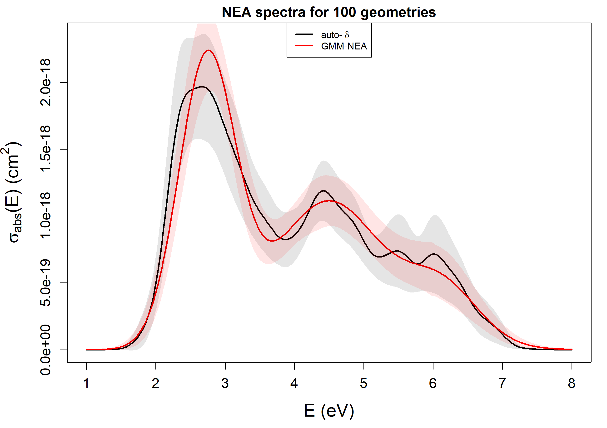

GMM-NEA 
======

## Overview

`R` code implementing the methodologies reported in the paper "*Reconstruction of Nuclear Ensemble Approach Electronic Spectra using Probabilistic Machine Learning*" (L. Cerdán and D. Roca-Sanjuán, 2022). 
It contains a fully functional version of the algorithm to reconstruct the NEA spectra using Kernel Density Estimation (KDE) Silverman's rule of thumb to choose the phenomenological
bandwidth *d* (auto-*d*) and using Gaussian Mixture Models to avoid *d* altogether (GMM-NEA).


## Requirements and Dependencies

It requires the installation of [R](https://cran.r-project.org/) (and optionally the [Rstudio IDE](https://www.rstudio.com/products/rstudio/)).

Before running this script, make sure that the following packages are installed: 

`'stats'` `'scales'` `'robustbase'` `'matrixStats'` `'mclust'` `'foreach'` `'doParallel'` `'parallel'`

## Usage

1) Save the source files `GMM_NEA.R` and `GMM_NEA_helper_funcs.R` into a folder. 

2) Into that same folder save the `.csv` file containing the values of the vertical excitation energies (*VEE*) and oscillator strengths (*f*) 
for all transitions (columns) and geometries/configurations (rows) to reconstruct the NEA spectrum. The first half of the columns contain the *VEE*, the second half the *f*. 
An example of this kind of file can be found in the folder `Data`.

3) Access a terminal (OS or RStudio), go to the folder containing the source files, and type:

```
$ Rscript GMM_NEA.R input_file molecule [no_outliers] [ci]
```

The argument `input_file` specifies the name of the `.csv` file containing the *VEE* and *f* values.

The argument `molecule` specifies the molecule name/identifier to add to the output files

The *optional* argument `no_outliers` specifies the program to ignore outliers.

The *optional* argument `ci` tells the program to compute the confidence intervals (CI) of the NEA spectrum.

#### Output

Once the computation is over, the following files are saved into the folder `./molecule`:

1. auto_d_spectra_eV_*n_geoms*_*molecule*.csv

2. GMM_NEA_spectra_eV_*n_geoms*_*molecule*.csv

3. Spectra_eV_auto_d_vs_GMM_NEA_*n_geoms*_*molecule*.png

Files 1 and 2 contain the dataset with the computed NEA absorption cross section (in cm^2) as a function of energy (in eV) 
for the whole spectrum (`sigma_cm2_full`) and for each transition (`sigma_cm2_Band_#`), together with their corresponding
confidence intervals (CI). File 3 is a plot of the NEA spectra computed both with auto-*d* and GMM-NEA (see examples below). The headers in Files 
1 and 2 summarize the input and the model parameters used to reconstruct the NEA spectra. For auto-*d* (File 1), it includes 
the empirical bandwidths *d* for each transition. For GMM-NEA (File 2), it includes the number of mixtures (*K*) and the model constraints
(*M*) for each transition. If any outlier is detected, the corresponding geometry/configuration
is stated as well in the header (*Skipped geometries (outliers)*).

A sample of Files 1 and 2 can be found in the folder `Data`.

#### Examples: 

```
$ Rscript GMM_NEA.R vee_f_uracil_radical.csv U6OH ci
```



```
$ Rscript GMM_NEA.R vee_f_benzene.csv benzene_no_ci no_outliers
```


## Reference

L. Cerdán and D. Roca-Sanjuán, Reconstruction of Nuclear Ensemble Approach Electronic Spectra using Probabilistic
Machine Learning. *J. Chem. Theory Comput.*,  2022, XXX, XXX−XXX
